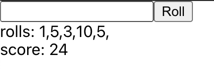

# pair-prog-react

## Spec:
Calculer le score d'un jeu de bowling simple
(ne pas prendre en compte les Spare / Strike pour le calcule)

## Features:
1. Un champs texte pour entrer le nombre de quilles tomber sur un lancer
2. Un bouton pour valider mon score sur ce lancer
3. Un paragraph affiche le score total de la partie
4. Un paragraph affiche le nombre de quille pour chaque lancer

## Special:
1. Un message d'erreur s'affiche si le nombre de quilles est incorrect (null ou > 10)
2. Après avoir validé mon lancer le champs texte redevient null

## Bonus (a discuter a la fin):
1. Après 20 lancer redemarrer le jeux
2. gérer le spare
3. gérer le strike